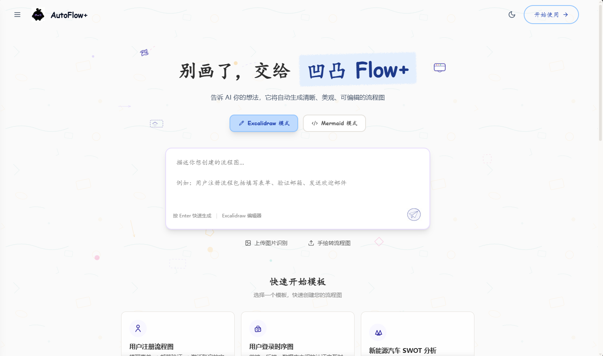

# AutoFlow+

AI 驱动的智能图表生成工具，支持 **Excalidraw 手绘风格** 与 **Mermaid 代码渲染** 双模式编辑，具备结构化精准增量编辑能力。



## 功能特性

- **双模式编辑**：Excalidraw 手绘风格 + Mermaid 代码渲染，一句话描述即可生成专业图表
- **混合分流架构**：AI 自动判断图表类型，智能选择最优渲染路径（Skeleton 直出 或 Mermaid 转换）
- **结构化增量编辑**：生成图表后，通过 Diff DSL 精准修改局部元素，无需全图重新生成
- **画布选中编辑**：选中画布元素直接输入指令，修改样式/文字/位置，即改即得
- **聊天渐进搭图**：在聊天中逐步增删节点和连线，像对话一样迭代构建图表
- **撤销/重做**：Ctrl+Z / Ctrl+Shift+Z，基于快照的历史栈，不怕改错
- **图片识别**：上传手绘草图或截图，AI 自动识别并转换为可编辑图表
- **项目管理**：创建、保存、重命名、删除项目，本地持久化存储
- **SSE 流式生成**：实时推送生成进度，支持 Skeleton 自动纠错重试

## 核心架构

### 1. Excalidraw 模式混合分流

AI 首行声明输出格式，后端根据格式自动分流到不同处理管道：

| 输出格式 | 适用图表 | 技术实现 | 特点 |
|----------|----------|----------|------|
| **FORMAT: skeleton** | SWOT、组织架构、思维导图、ER 图、类图、甘特图、状态图、饼图、象限图、鱼骨图、网络拓扑、泳道图、时间线等 | AI 直出 Excalidraw JSON 数组 → Skeleton 管道（清洗/校验/修正/居中）→ `convertToExcalidrawElements` + `restoreElements` 渲染 | 零解析损耗，像素级精准布局，完全可编辑 |
| **FORMAT: mermaid** | 流程图、时序图 | AI 生成 Mermaid 代码 → 清洗/校验 → `@excalidraw/mermaid-to-excalidraw` 转换 → 不兼容语法降级为 SVG 贴图兜底 | 语法标准化，官方转换器保证质量 |

- **自动纠错**：Skeleton 校验失败时自动将错误反馈给 AI 重试，最多 2 次
- **提示词策略**：Zero-shot，自然语言布局指引，AI 自行理解并计算坐标

### 2. 结构化精准增量编辑

生成图表后，通过 Diff DSL 精准修改，而非全图重新生成：

| 交互模式 | 触发方式 | 可改范围 |
|----------|----------|----------|
| **聊天渐进搭图** | 聊天面板发消息（画布有元素时自动触发） | 增删节点/连线 + 样式/文字/布局 |
| **画布选中编辑** | 画布选中元素 → 弹出输入框 | 样式/文字/位置（不增删节点） |

**核心模块**：

- **[GraphModel](frontend/src/lib/graphModel.ts)**：将 Excalidraw 原始 JSON 抽象为 `{ nodes, edges, layout }` 结构化模型，提供 `elementsToGraphModel()` / `graphModelToElements()` 互转
- **[DiffEngine](frontend/src/lib/diffEngine.ts)**：执行 LLM 返回的增量变更指令，支持 7 种操作（add_node / delete / update_style / update_text / add_edge / reorder / move），删除节点自动清理关联边
- **[UndoStack](frontend/src/lib/undoStack.ts)**：基于快照的历史栈（maxSize=50），Ctrl+Z 撤销 / Ctrl+Shift+Z 重做
- **[SelectionEditBar](frontend/src/components/SelectionEditBar.tsx)**：画布选中元素时自动弹出输入框，半透明毛玻璃样式，viewport 边界自适应

### 3. Mermaid 模式

独立渲染路径，使用 Mermaid.js 直接渲染 SVG（不可编辑），支持全部 Mermaid 语法。

## 技术栈

| 层级 | 技术 |
|------|------|
| 前端 | Next.js 14 + React 18 + TypeScript + Tailwind CSS v4 |
| 图表引擎 | @excalidraw/excalidraw + @excalidraw/mermaid-to-excalidraw + Mermaid.js |
| 后端 | FastAPI + Python 3.10+ |
| AI 服务 | httpx 调用 OpenAI 兼容接口（支持 SSE 流式） |

## 快速开始

### 环境要求

- Node.js >= 18
- Python >= 3.10

### 安装与启动

```bash
# 1. 克隆仓库
git clone <repo-url>
cd AutoFlow+

# 2. 启动后端
cd backend
python -m venv venv
source venv/bin/activate  # Windows: venv\Scripts\activate
pip install -r requirements.txt
cp .env.example .env      # 填写 LLM_API_KEY / LLM_BASE_URL / LLM_MODEL_ID
python main.py            # 或: uvicorn main:app --reload --port 8000

# 3. 启动前端（新终端）
cd ../frontend
npm install
npm run dev
```

访问 http://localhost:3000 即可使用。

### 环境变量

```env
LLM_API_KEY=your-api-key
LLM_BASE_URL=https://api.openai.com/v1/chat/completions
LLM_MODEL_ID=gpt-4o
```

## 项目结构

```
AutoFlow+/
├── frontend/src/
│   ├── app/
│   │   ├── page.tsx                       # 首页：模式选择 + prompt 输入
│   │   ├── canvas/excalidraw/page.tsx     # Excalidraw 编辑器（SSE 流式 + 增量编辑）
│   │   ├── canvas/mermaid/page.tsx        # Mermaid 编辑器
│   │   ├── projects/page.tsx              # 项目管理
│   │   └── settings/page.tsx              # LLM 配置
│   ├── lib/
│   │   ├── excalidrawConverter.ts         # Skeleton 渲染 + Mermaid 转换 + SVG 兜底
│   │   ├── graphModel.ts                  # [增量编辑] GraphModel 中间表示层
│   │   ├── diffEngine.ts                  # [增量编辑] Diff DSL 执行引擎
│   │   ├── undoStack.ts                   # [增量编辑] 撤销/重做历史栈
│   │   ├── mermaidUtils.ts                # Mermaid 清洗/方向转换
│   │   └── projectApi.ts                  # 项目 API 客户端
│   └── components/
│       └── SelectionEditBar.tsx           # [增量编辑] 画布选中弹出输入框
├── backend/
│   ├── main.py                            # FastAPI 入口
│   ├── api/routes.py                      # REST 端点（含 SSE 流式 + 增量编辑）
│   ├── models/schemas.py                  # Pydantic 模型
│   ├── services/
│   │   ├── ai_service.py                  # LLM 调用 + SSE 流式 + 增量编辑
│   │   └── project_service.py             # 项目 CRUD
│   ├── prompts/system_prompts.py          # 混合提示词 + 增量编辑提示词
│   └── utils/
│       ├── excalidraw_utils.py            # Skeleton 管道：清洗/校验/标准化/居中
│       ├── mermaid_utils.py               # Mermaid 代码提取/校验
│       └── project_utils.py               # JSON 读写辅助
└── data/
    ├── projects.json                      # 项目数据
    └── uploads/                           # 上传图片
```

## 许可证

[MIT](LICENSE)
